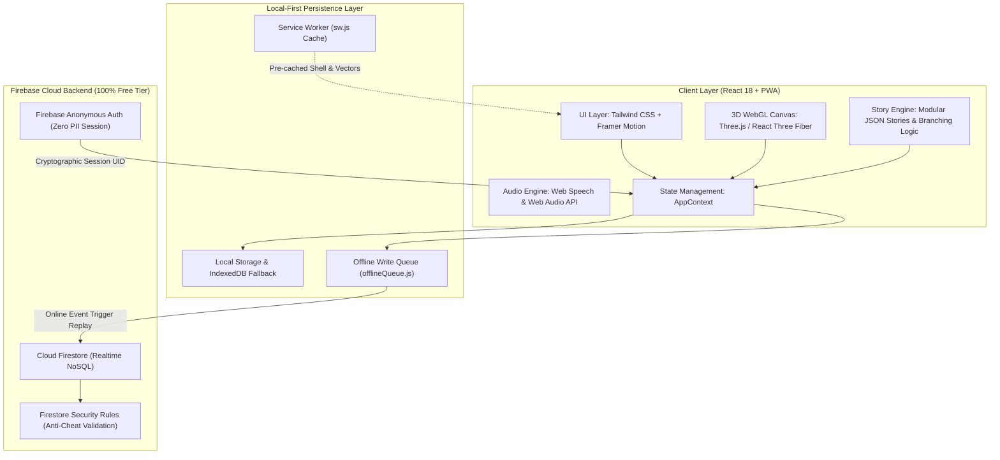

# Legalese: The Rights Quest Journey — 3-4 Minute Pitch & Tech Stack Blueprint (`PITCH.md`)

> **Elevator Hook:** "Over 250 million children in India grow up without knowing their constitutional rights. Legalese transforms dry statutory law into an offline-first, 3D interactive storybook RPG — engineered with a 100% serverless, zero-cost, DPDP-compliant tech stack built specifically for low-end devices and patchy connectivity."

---

## ⏱️ 3-4 Minute Spoken Pitch Script

| Time Stamp | Section Title | Primary Objective & Tone |
|---|---|---|
| **[0:00 - 0:30]** | **Hook & The Problem** | Emotional urgency, systemic legal literacy gap |
| **[0:30 - 1:15]** | **The Solution: Rights Quest** | Game mechanics, consequence recovery arcs, certificates |
| **[1:15 - 2:30]** | **Deep-Dive Tech Stack & Architecture** | Core technical innovations, rendering, audio, performance |
| **[2:30 - 3:15]** | **Offline-First Resilience & Zero PII** | Local-first write queue, DPDP compliance, Spark free tier |
| **[3:15 - 3:45]** | **Ecosystem & Teacher Toolkit** | Verified pro-bono advocate portal, lesson plans |
| **[3:45 - 4:00]** | **Closing Punchline & Q&A Open** | Strong, memorable finish |

---

### 🎙️ Spoken Script with Delivery Cues

#### [0:00 - 0:30] 1. Hook & Problem
*(Tone: Urgent, Empathetic, Grounded)*

> "Respected judges, over **250 million children in India** grow up vulnerable to statutory violations — illegal school fees, child labour, physical abuse under POCSO, and early marriage. Yet, traditional legal literacy is either locked in dry, intimidating textbooks or commercial EdTech dashboards requiring high-speed broadband and high-end phones.
> 
> When a child's rights are violated, they often don't know the law is on their side — or worse, they blame themselves.
> 
> We asked a fundamental engineering question: *Can we put the protective power of the Indian Constitution directly into a child's hands on a ₹5,000 smartphone, even with zero internet connectivity?*"

---

#### [0:30 - 1:15] 2. The Solution: Legalese Rights Quest
*(Tone: Energetic, Dynamic — [Demo: Show interactive story node branching])*

> "That is why we built **Legalese**. Legalese reimagines legal rights education as an interactive, gamified storybook RPG across 5 core constitutional journeys:
> * **Article 21-A** (Right to Free & Compulsory Education)
> * **Article 21** (Right to Healthcare & Dignity)
> * **Child Labour Act**
> * **POCSO Act 2012** (Protection from Abuse)
> * **PCMA 2006** (Protection from Child Marriage)
> 
> What sets Legalese apart is our **Branching Moral Dilemma Engine**. If a student chooses an unsafe shortcut — like selling belongings to pay illegal fees — the engine branches into a *consequence recovery arc* proving why statutory remedies are safer than informal fixes. As they progress, they earn constitutional badges, test knowledge in non-punitive quizzes, and generate a printable **Rights Defender Certificate**."

---

#### [1:15 - 2:30] 3. Core Tech Stack Breakdown (The Engineering Backbone)
*(Tone: Confident, Technical, Structured — [Demo: Showcase 3D canvas, offline toggle, and instant reactivity])*

> "Let's look under the hood at the engineering architecture that powers Legalese:
>
> 1. **Modern React & Build Architecture**: Built on **React 18.3** and bundled via **Vite 5**, providing sub-millisecond HMR during development and tree-shaken, ultra-compact production bundles. UI layout uses **Tailwind CSS 3.4** and atomic CSS design tokens for zero runtime calculation overhead.
> 2. **3D Visuals & Hardware Acceleration**: We render interactive 3D constitutional artifacts using **Three.js** integrated via **`@react-three/fiber`** and **`@react-three/drei`**. Paired with **Framer Motion** and **Lenis** smooth momentum scrolling, the UI delivers 60fps fluid visual feedback.
> 3. **100% Vector Asset Pipeline**: To run on low-bandwidth rural networks, we completely eliminated heavy raster images. Every character, prop, and scene is procedurally rendered via **modular SVGs** and pure CSS. The total initial JavaScript/asset payload is under **350 KB gzipped**.
> 4. **Multimodal Audio Engine**: Built using a dual-layer audio architecture: **Web Audio API** synthesized chimes and sound effects combined with the browser's native **SpeechSynthesis API** for multi-dialect narration in English, Hindi, and Kannada — requiring zero external audio CDN bandwidth."

---

#### [2:30 - 3:15] 4. Offline-First Resilience, Data Privacy & Cloud Architecture
*(Tone: Crisp, Problem-Solving, Architecture-First)*

> "Our most critical technical achievement is **Zero-Failure Offline Resilience**:
> 
> * **Offline-Write Queue & Auto-Replay Engine**: In `offlineQueue.js`, we built an event-driven write buffer backed by `localStorage` and Service Workers. If a student completes a quest in a network dead-zone, their XP, badge mutations, and quiz results are buffered safely. The instant network connectivity returns, an automatic `window.online` listener replays and synchronizes the queue to **Cloud Firestore**.
> * **Zero PII & DPDP Act 2023 Compliance**: Child safety is baked into our architecture. We collect **zero** names, emails, phone numbers, or passwords. Using **Firebase Anonymous Authentication**, children are assigned cryptographic UIDs paired with custom parametric avatars and anonymous handles like *BraveTiger42*.
> * **100% Free-Tier Spark Scalability**: By pushing verification logic to client-side Firestore Security Rules (`users/{uid}.xp >= leaderboard/{uid}.xp`), we run with **zero paid Cloud Functions or backend VM servers**, allowing nationwide NGO deployment at $0 infrastructure cost."

---

#### [3:15 - 3:45] 5. Ecosystem & Verified Legal Advocate Portal
*(Tone: Inspiring, Ecosystem-Focused)*

> "Legalese extends beyond the individual child into a full educational ecosystem:
> * **Educator Toolkit**: 5 plug-and-play classroom lesson plans and post-game discussion guides mapped to CBSE/State Board civic learning outcomes.
> * **Moderated Legal Q&A Portal**: Minor users can submit questions regarding real-life rights issues, answered exclusively by verified pro-bono advocates and Child Welfare Committees (CWCs) — intentionally eliminating unmoderated child-to-child direct messaging to ensure 100% child safety."

---

#### [3:45 - 4:00] 6. Closing Punchline
*(Tone: Memorable, Impactful)*

> "Legalese proves that cutting-edge web engineering — WebGL, Service Workers, React, and local-first data sync — can take the most complex statutory laws and place them into the hands of the children who need them most.
> 
> **Legalese: Where courage teaches children their rights.** Thank you, and we welcome your technical questions!"

---

## 🛠️ Complete Tech Stack Reference Matrix

| Architectural Layer | Core Technologies | Engineering Role & Advantages |
|---|---|---|
| **Frontend Framework** | **React 18.3**, **Vite 5.2**, **React Router DOM 6** | Micro-second cold starts, declarative state-driven routing, modular component hierarchy. |
| **3D & Canvas Graphics** | **Three.js 0.185**, **`@react-three/fiber`**, **`@react-three/drei`** | Interactive 3D constitutional models and badge tokens rendered via hardware-accelerated WebGL. |
| **Animation & Micro-interactions** | **Framer Motion 13**, **Canvas-Confetti**, **Lucide React** | Gesture-driven UI animations, particle celebration confetti, crisp SVG icon typography. |
| **Styling & Design System** | **Tailwind CSS 3.4**, **CSS Custom Variables (`tokens.css`)** | Zero runtime CSS parsing overhead, accessible WCAG-compliant color contrasts, responsive layout. |
| **State & Local Persistence** | **React Context (`AppContext`)**, **`storageEngine.js`** | Single-source-of-truth global state with robust fallback handling between memory and LocalStorage. |
| **Offline Engine & PWA** | **Service Workers (`sw.js`)**, **Web App Manifest**, **Vite PWA** | Full asset precaching, installable as standalone PWA on Android, iOS, and Chromebooks. |
| **Data Sync Engine** | **Custom Offline Queue (`offlineQueue.js`)** | Intercepts offline Firestore writes, buffers in LocalStorage, auto-replays via `window.online` events. |
| **Backend & Cloud DB** | **Firebase Cloud Firestore**, **Firebase Anonymous Auth** | Realtime document sync, instant anonymous sign-in, 100% Spark Free-Tier ($0 hosting expense). |
| **Security & Data Privacy** | **DPDP Act 2023 Architecture**, **Firestore Rules** | Zero PII collection, cryptographic anonymous sessions, client-validated anti-cheat security rules. |
| **Audio & Narration Engine** | **Web Audio API**, **Web SpeechSynthesis API (`narration.js`)** | Synthesized sound FX & dynamic multilingual text-to-speech without external MP3 CDN streaming. |
| **Localization (i18n)** | **Modular JSON Schema Engine** | Instant seamless switching between English, Hindi, and Kannada without page reloads. |

---

## 📐 System Architecture Diagram

---

## 🎯 Anticipated Tech Stack Q&A for Judges

### Q1: Why did you choose Firebase Spark (Free-Tier) over a custom Node.js / Express backend?
> **Answer:** *"For rural school adoption and non-profit scaling, server maintenance and hosting costs are the #1 point of failure. Firebase Anonymous Auth + Firestore gives us sub-100ms global latency, automatic offline document sync, and 50,000 free daily reads with $0 cloud bills and zero server maintenance overhead."*

### Q2: How does the application perform on low-end ₹5,000 Android devices with 2G/3G connectivity?
> **Answer:** *"We engineered for extreme low-resource environments:
> 1. **Zero Raster Images:** Every character, badge, and scene prop is 100% SVG/CSS vector code.
> 2. **Native Speech Synthesis:** Audio narration uses browser-native TTS instead of streaming audio files.
> 3. **Sub-350KB Bundle:** The initial compressed payload loads in under 1.5 seconds even on 2G connections."*

### Q3: How do you prevent XP cheating or leaderboard spoofing without serverless Cloud Functions?
> **Answer:** *"We enforce integrity using Firestore Security Rules. The database rejects any write where `request.resource.data.xp` increments by more than the maximum allowable XP delta per story, and validates that the story ID exists in the user's `completedStories` array."*

### Q4: How is Legalese compliant with the DPDP (Digital Personal Data Protection Act 2023)?
> **Answer:** *"We practice 'Privacy by Design'. We deliberately do not have input fields for real names, emails, phone numbers, schools, or GPS locations. Users authenticate anonymously and choose parametric vector avatars with generated animal gamertags."*

### Q5: How does the offline queue handle race conditions or dropped sync attempts?
> **Answer:** *"Our `offlineQueue.js` implementation reads and mutates an atomic queue in `localStorage`. When the `online` event fires, each task is replayed in sequential FIFO order. If a Firestore write fails midway, the remaining tasks stay buffered for the next online ping without duplicating completed actions."*
